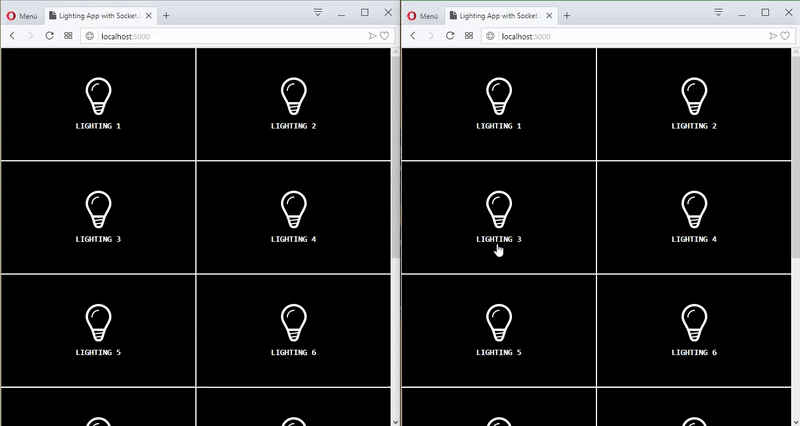

# Lighting App with Socket.io

A basic real-time lighting app using socket.io.



### Stack

* Node.js
* Express.js
* Socket.io
* MongoDB

### Installation

1. Start mongo deamon with below command line:

   ```bash
   mongod --directoryperdb --nojournal --dbpath "path/to/your/app/data/db"
   ```

2. Navigate to app folder and install dependencies in package.json:

   ```bash
   npm i
   ```

3. Start app with below command line:

   ```bash
   node app.js
   ```

4. Finally open your browser and navigate to below adress:

   http://localhost:5000

